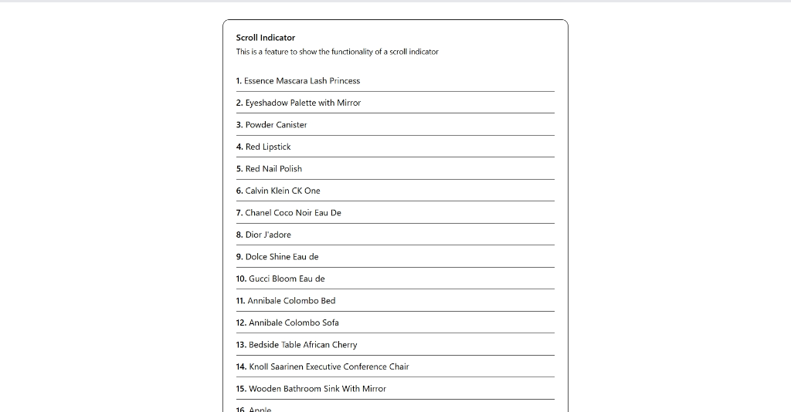

# 📜 Scroll Indicator Component

A professional, high-fidelity scroll progress indicator for modern React applications. This component provides real-time visual feedback of the user's scroll position, integrated with dynamic content fetching.



## 🚀 Live Demo

Check out the live demo here: [Live Demo](https://react-scroll-indicator-feature.pages.dev/)

## ✨ Features

- **Real-time Tracking**: Dynamically calculates and displays scroll progress.
- **Visual Feedback**: Sleek top-bar indicator with smooth easing transitions.
- **Data Integration**: Automatically fetches and displays list items from a provided API URL.
- **Responsive Design**: Fully optimized for all screen sizes using **Tailwind CSS**.
- **Modern UI**: Built with **Shadcn UI** for a premium look and feel.
- **Type Safety**: Fully implemented with **TypeScript** for robust development.

## 🛠️ Built With

- **React 19**
- **Vite**
- **Tailwind CSS**
- **Shadcn UI**
- **TypeScript**

## 📥 Getting Started

### Installation

1. **Clone the repository**:

   ```bash
   git clone https://github.com/yehiaaly/react-scroll-indicator-feature.git
   ```

2. **Install dependencies**:

   ```bash
   npm install
   ```

3. **Run the development server**:
   ```bash
   npm run dev
   ```

## 📖 Documentation

### Usage Example

```tsx
import ScrollIndicator from "./components/scroll-indicator/ScrollIndicator";

const App = () => {
  return (
    <div className="min-h-screen">
      <ScrollIndicator url="https://dummyjson.com/products?limit=100" />
    </div>
  );
};

export default App;
```

### Prop Documentation

| Prop  | Type     | Default     | Description                                             |
| :---- | :------- | :---------- | :------------------------------------------------------ |
| `url` | `string` | `undefined` | The API endpoint to fetch data for the scrollable list. |

### Project Structure

```text
src/
├── components/
│   ├── scroll-indicator/
│   │   ├── ScrollIndicator.tsx
│   │   └── dataType.ts
│   └── ui/
│       └── card.tsx
├── lib/
│   └── utils.ts
├── App.tsx
├── index.css
└── main.tsx
```
